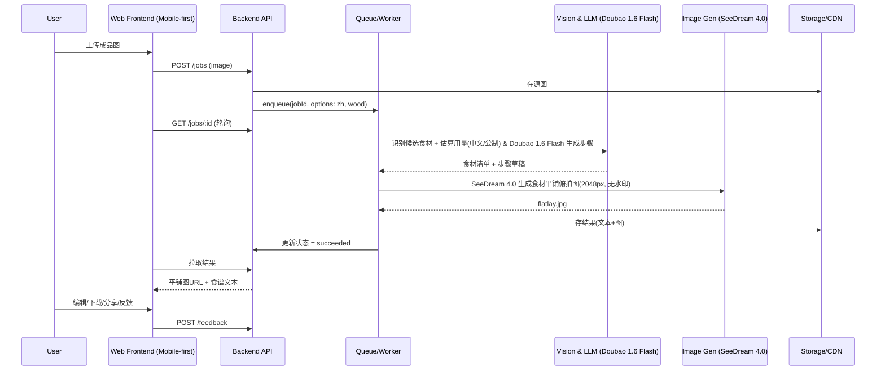

### 产品需求文档（PRD） — 成品菜照片一键生成“食材平铺图 + 中文食谱”

—— 最终确认（原型：方案 C｜移动优先）

## 核心目标 (Mission)
让用户用一张成品菜照片，快速获得“高质感食材平铺图（2048px，无水印原图，固定木质案板背景）”与“中文、公制、可编辑的食谱文本”，将灵感即时转化为可执行的烹饪方案。首发形态：网页应用（Web App）。

## 用户画像 (Persona)
- 家庭厨师/新手：看图即学会做菜，需要明确的食材、公制用量区间与步骤。

## V1: 最小可行产品 (MVP)
- 图片输入：上传/拍摄单道菜成品图（JPG/PNG ≤ 10MB）。
- 异步一键生成（目标 < 15s，超时降级 < 20s）：
  - 食材平铺摆拍图：固定“俯拍 + 自然光 + 模板化摆放”，背景固定为木质案板；导出短边 2048px，无水印原图。
  - 中文食谱文本：食材中文名 + 公制用量“估算区间”，3–8 步烹饪步骤。
- 可编辑：结果页直接编辑食材名、用量、步骤并保存（写回同一 Job）。
- 导出/分享：下载摆拍图（JPG）、复制食谱文本、匿名分享链接。
- 反馈：准确/不准 + 备注（用于迭代提示与数据标注）。
- 账号：无需登录；匿名数据存储 7 天后清理。

## V2 及以后版本 (Future Releases)
- 交互校正：在成品图中点选/框选食材，半自动纠错再生成。
- 多风格模板：不同器皿/布景/摄影风格与光比；批量与API。
- 食材替代与营养/过敏信息；购物清单与商超对接。
- 账号体系、历史库、团队协作、多语言与单位转换。
- 社区模板与案例库。

## 关键业务逻辑 (Business Rules)
- 单道菜原则：检测到拼盘/多道菜则提示更换或（V2）进入多目标模式。
- 推理时限与降级：单次 ≤ 20s；超时先返回文本，再补图；失败自动重试 1 次。
- 单位与语言：仅中文与公制（克、毫升、汤匙、茶匙、个）。用量以区间表述（如 150–200 克）。
- 内容安全：非食材主导/不当内容拒绝生成；提示理由。
- 版权与水印：仅处理用户授权图片；生成图默认无水印原图（下载页提示“AI生成”说明文字）。
- 数据保留：匿名 7 天生命周期策略（对象存储 + CDN 规则）。

## 数据契约 (Data Contract) — MVP
```json
{
  "ImageUpload": {
    "id": "string",
    "url": "string",
    "width": 0,
    "height": 0,
    "createdAt": "ISODate"
  },
  "GenerationJob": {
    "id": "string",
    "status": "queued|running|succeeded|failed|partial",
    "inputImageId": "string",
    "options": { "background": "wood|white", "language": "zh" },
    "outputs": { "ingredientFlatlayUrl": "string?", "recipeText": "string?" },
    "error": { "code": "string", "message": "string" },
    "createdAt": "ISODate",
    "completedAt": "ISODate?"
  },
  "Ingredient": {
    "name": "string",
    "quantityText": "string",
    "confidence": 0.0
  },
  "Recipe": {
    "id": "string",
    "ingredients": ["Ingredient"],
    "steps": ["string"],
    "locale": "zh-CN",
    "derivedFromJobId": "string"
  },
  "Feedback": {
    "jobId": "string",
    "rating": "up|down",
    "note": "string?",
    "createdAt": "ISODate"
  }
}
```

## MVP 原型（选定：方案 C｜移动优先）
```
+-------------------+
| [+] 上传/拍照     |
| 进度 12s          |
|-------------------|
| 平铺图预览        |
| [放大][重新生成]  |
|-------------------|
| 食材(可编辑)      |
| 番茄 300-350g [✎] |
| 洋葱 80-120g  [✎] |
| ...               |
|-------------------|
| 步骤(可编辑)      |
| 1... 2... 3...    |
|-------------------|
| [下载图] [复制食谱]|
| [分享] [准确/不准] |
| 说明: AI 生成内容仅供参考，注意食材过敏 |
+-------------------+
```

## 架构设计蓝图

### 核心流程（Mermaid）


### 组件交互说明
- 前端（Next.js/React + Tailwind，网页应用）：移动优先布局，直传对象存储（加速上传），结果页内联编辑与下载/分享。
- 后端 API（Node.js + Fastify/NestJS）：`POST /jobs`、`GET /jobs/:id`、`POST /feedback`、签名上传（可选）。
- 队列/Worker（Redis + BullMQ）：串联视觉识别、LLM 文生文与图像生成；状态回写。
- 模型服务：
  - 文本/步骤生成：Doubao 1.6 Flash（火山方舟），`/api/v3/chat/completions`，模型 `doubao-seed-1-6-flash-250828`。
  - 图像生成：SeeDream 4.0（图片生成大模型），调用约定：
    - Endpoint: `https://ark.cn-beijing.volces.com/api/v3/images/generations`
    - Header: `Authorization: Bearer ${SEEDREAM_API_KEY}`、`Content-Type: application/json`
    - Body: `{ model: "doubao-seedream-4-0-250828", prompt, response_format: "url", size: "2K", stream: false, sequential_image_generation: "disabled", watermark: false }`
    - 与产品约束对齐：size=2K（约等于短边2048px）、watermark=false（无水印原图）。
  - 说明：以适配器封装，保留可替换性；密钥以环境变量注入。
- 存储/CDN：S3 兼容存储 + CDN；生命周期 7 天；结果元数据入库（PostgreSQL/KV）。

### 技术选型与风险
- 技术选型：
  - 前端：Next.js、Tailwind、直传到对象存储；移动优先组件。
  - 后端：Node.js（NestJS/Fastify）、Redis + BullMQ、PostgreSQL/KV。
  - 模型：外部 API 优先（降低冷启动与运维）；V2 评估自建推理（SDXL + ControlNet/IP-Adapter）。
  - 监控：Sentry + 简单埋点；作业日志与失败告警。
- 风险与缓解：
  - 识别准确度：V1 采用“估算区间 + 可编辑”，V2 上交互校正。
  - 生成风格稳定性：固定俯拍与模板化提示；必要时引入参考构图与 Control 模块。
  - 成本与延迟：异步队列、阶段化产出；失败自动降级“先文本后补图”。
  - 合规与隐私：不当内容拦截；授权声明；匿名 7 天自动清理。

---

## 验收与指标
- 体验闭环：上传→生成→编辑→导出/分享，移动端单手可完成。
- 时延：P50 ≤ 15s（文本或图任一产出即回显进度），P95 ≤ 20s。
- 成本：单作业成本 ≤ 设定预算阈值（可按月度观察与动态调参）。
- 质量：用户“准确”反馈率 ≥ 60%（MVP 阶段基线），收集 100+ 备注样本用于提示与模板迭代。

## 上线策略
- 限流灰度：每日限量配额 + 排队提示；高峰期优先文本产出。
- 埋点：上传成功率、排队时长、各阶段耗时、编辑率、导出率、反馈率。
- 运维：队列可视化面板、失败重试与死信队列、CDN 命中率监控。


